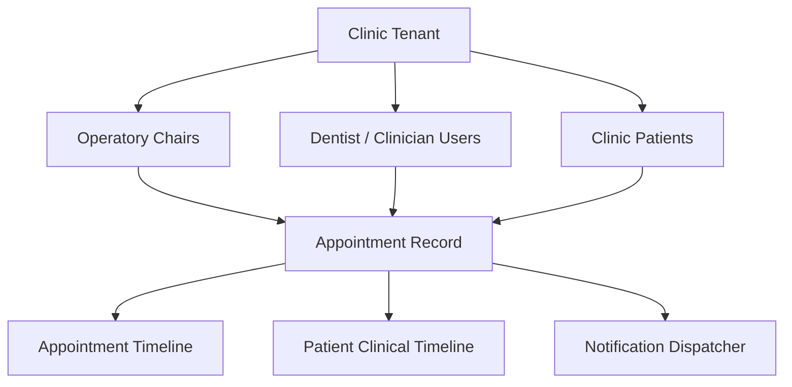
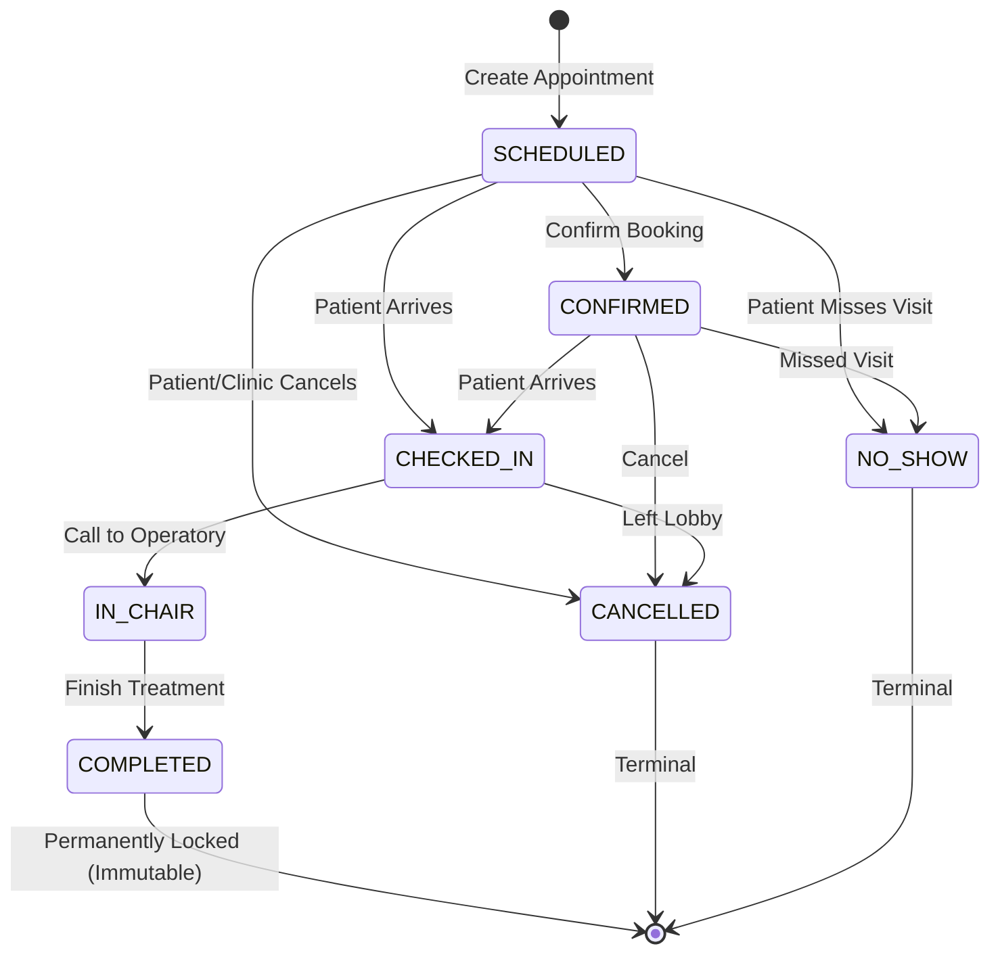

# DentalCare Pro – Appointment & Calendar Management Module

This document specifies the technical design, domain models, APIs, scheduling algorithms, state machines, and operational workflows for the **Appointment & Calendar Management Module** (Phase 3).

---

## 1. Architectural Overview & Clinic Isolation

Every appointment entity is strictly isolated by `clinic_id`. An appointment belongs to exactly four primary domain concepts:
1. **Clinic**: The multi-tenant partition (`clinic_id`).
2. **Patient**: The recipient of dental care (`patient_id`).
3. **Dentist / Clinician**: The healthcare provider (`dentist_id`, references `users.id`).
4. **Chair / Operatory**: The physical surgical chair or operatory room (`chair_id`, references `chairs.id`).

All queries, reads, modifications, conflict scans, and queue aggregations enforce tenant isolation at the database repository layer via explicit `clinic_id` filtering.

---

## 2. Database Models & Alembic Migration

The module introduces five normalized database tables managed under Alembic migration `20260908_0004_appointments.py`.

### 2.1 `chairs`
Represents physical operatory spaces in the dental practice.
- `id` (UUID, PK)
- `clinic_id` (UUID, FK -> `clinics.id`, indexed)
- `name` (VARCHAR(120), e.g., "Chair 1 - General Operatory")
- `room_number` (VARCHAR(60), optional)
- `status` (`ACTIVE`, `MAINTENANCE`, `INACTIVE`)
- `notes` (TEXT, optional)
- `created_at`, `deleted_at` (soft deletion supported)
- **Constraint**: `uq_chairs_clinic_name_active` ensures unique chair names per clinic among active records.

### 2.2 `dentist_working_hours`
Configures recurring clinical availability by day of the week.
- `id` (UUID, PK)
- `clinic_id` (UUID, FK -> `clinics.id`)
- `dentist_id` (UUID, FK -> `users.id`, indexed)
- `day_of_week` (INTEGER, 0 = Monday, 6 = Sunday)
- `start_time` (TIME, e.g., 09:00)
- `end_time` (TIME, e.g., 18:00)
- `break_start` (TIME, optional, e.g., 13:00)
- `break_end` (TIME, optional, e.g., 14:00)
- `is_working_day` (BOOLEAN)
- **Constraint**: `uq_dentist_working_day` prevents duplicate schedule rows for the same dentist on the same day.

### 2.3 `dentist_blocked_times`
Ad-hoc vacation, emergency leave, or surgery blocks for a dentist.
- `id` (UUID, PK)
- `clinic_id` (UUID, FK -> `clinics.id`)
- `dentist_id` (UUID, FK -> `users.id`, indexed)
- `date` (DATE)
- `start_time` (TIME)
- `end_time` (TIME)
- `reason` (VARCHAR(255))
- `created_by` (UUID, FK -> `users.id`)

### 2.4 `appointments`
The central scheduling record.
- `id` (UUID, PK)
- `clinic_id` (UUID, FK -> `clinics.id`, indexed)
- `patient_id` (UUID, FK -> `patients.id`, indexed)
- `dentist_id` (UUID, FK -> `users.id`, indexed)
- `chair_id` (UUID, FK -> `chairs.id`, indexed)
- `appointment_number` (VARCHAR(32), sequential: `APT-YYYYMMDD-XXXX`)
- `date` (DATE, indexed)
- `start_time` (TIME, indexed)
- `end_time` (TIME, indexed)
- `duration` (INTEGER, minutes, between 5 and 480)
- `status` (`SCHEDULED`, `CONFIRMED`, `CHECKED_IN`, `IN_CHAIR`, `COMPLETED`, `CANCELLED`, `NO_SHOW`)
- `visit_type` (`CONSULTATION`, `CHECKUP`, `CLEANING`, `PROCEDURE`, `SURGERY`, `FOLLOW_UP`, `EMERGENCY`)
- `priority` (`LOW`, `NORMAL`, `HIGH`, `URGENT`)
- `chief_complaint` (TEXT, optional)
- `notes` (TEXT, optional)
- `cancellation_reason` (TEXT, optional)
- `is_emergency_override` (BOOLEAN, default `False`)
- `created_at`, `updated_at`, `deleted_at`

### 2.5 `appointment_timeline_events`
Chronological state audit log for appointment status changes.
- `id` (UUID, PK)
- `clinic_id` (UUID, FK -> `clinics.id`)
- `appointment_id` (UUID, FK -> `appointments.id`, indexed)
- `from_status` (AppointmentStatus, nullable for creation)
- `to_status` (AppointmentStatus)
- `title` (VARCHAR(150))
- `notes` (TEXT, optional)
- `actor_id` (UUID, FK -> `users.id`, nullable)
- `created_at` (TIMESTAMP WITH TIME ZONE)

---

## 3. Availability & Conflict Prevention Engine

The `AppointmentService.check_availability()` algorithm enforces strict double-booking prevention across three distinct dimensions.

### 3.1 Interval Overlap Math
Two time windows $[S_1, E_1)$ and $[S_2, E_2)$ on the same date overlap if and only if:
$$\max(S_1, S_2) < \min(E_1, E_2)$$

Only active appointments whose status is not in (`CANCELLED`, `NO_SHOW`) and with `deleted_at IS NULL` are considered conflicts.

### 3.2 Conflict Vectors
When booking or rescheduling:
1. **Dentist Working Hours**: Verifies that the appointment falls strictly within the clinician's defined working hours and does not overlap with their configured lunch/break window.
2. **Dentist Blocked Times**: Verifies that clinician leave or surgery block does not intersect the proposed time.
3. **Dentist Double-Booking**: Ensures the clinician does not have another active appointment at that time.
4. **Operatory Chair Double-Booking**: Ensures the physical dental chair is not booked by another patient/clinician.
5. **Patient Double-Booking**: Ensures the patient does not have another overlapping appointment scheduled across any chair in the clinic.

### 3.3 Emergency Admin Override
In clinical emergencies, a clinic cannot turn away an acute trauma patient. The system provides an emergency override:
- **Eligible Roles**: `CLINIC_ADMIN` or `SUPER_ADMIN` only. Regular `DENTIST` or `RECEPTIONIST` roles cannot bypass scheduling constraints.
- **Prerequisite**: `visit_type` must be `EMERGENCY`.
- **Flag**: `is_emergency_override = True` must be explicitly asserted in the payload.
- **Audit**: Overridden appointments are permanently marked with `is_emergency_override = True`, displayed with a high-visibility warning badge in calendar and queues, and logged in both the appointment timeline and system audit logs.

---

## 4. State Machine & Immutability Rules

### 4.1 Transition Endpoints
- `POST /api/v1/appointments/{id}/confirm` -> transitions to `CONFIRMED`
- `POST /api/v1/appointments/{id}/checkin` -> transitions to `CHECKED_IN`
- `POST /api/v1/appointments/{id}/start` -> transitions to `IN_CHAIR`
- `POST /api/v1/appointments/{id}/complete` -> transitions to `COMPLETED`
- `POST /api/v1/appointments/{id}/cancel` -> transitions to `CANCELLED` (requires `reason`)
- `POST /api/v1/appointments/{id}/reschedule` -> updates date/time/chair, transitions back to `SCHEDULED`

### 4.2 Completed Immutability Guarantee
Once marked `COMPLETED`:
- The appointment cannot be edited (`PATCH /appointments/{id}` returns HTTP 400).
- The appointment cannot be cancelled (`POST /appointments/{id}/cancel` returns HTTP 400).
- The appointment cannot be rescheduled (`POST /appointments/{id}/reschedule` returns HTTP 400).
- The appointment cannot be soft-deleted (`DELETE /appointments/{id}` returns HTTP 400).

---

## 5. Dual Timeline Architecture

Every appointment status transition produces two synchronous timeline records:
1. **Appointment Timeline**: Appended to `AppointmentTimelineEvent` with `from_status`, `to_status`, `title`, and `actor_id`.
2. **Patient Clinical Timeline**: Appended to `PatientTimelineEvent` with corresponding clinical event types:
   - `APPOINTMENT_SCHEDULED`
   - `APPOINTMENT_CONFIRMED`
   - `PATIENT_CHECKED_IN`
   - `TREATMENT_STARTED`
   - `APPOINTMENT_COMPLETED`
   - `APPOINTMENT_CANCELLED`
   - `APPOINTMENT_RESCHEDULED`

---

## 6. Abstract Notification Dispatcher

The notification infrastructure is decoupled via abstract interfaces:
- `NotificationChannel` (Protocol): `send(intent: NotificationIntent, recipient: str, context: dict)`
- Implemented Mock/Log Channels: `MockSMSChannel`, `MockEmailChannel`, `MockWhatsAppChannel`.
- `NotificationService`: Dispatches asynchronous notification intents for:
  - `CONFIRMATION`: Triggered upon appointment booking or confirmation.
  - `REMINDER`: Scheduled for automated reminders prior to appointment.
  - `CANCELLATION`: Triggered when an appointment is cancelled with reason.
  - `RESCHEDULE`: Triggered when new date/time is established.
  - `FOLLOW_UP`: Triggered upon visit completion.

---

## 7. API Reference Catalog

| Endpoint | Method | Roles | Description |
|---|---|---|---|
| `/api/v1/chairs` | `GET` | All Clinic Users | List active operatory chairs in clinic |
| `/api/v1/chairs` | `POST` | `CLINIC_ADMIN`, `SUPER_ADMIN` | Create a new operatory chair |
| `/api/v1/chairs/{id}` | `PATCH` | `CLINIC_ADMIN`, `SUPER_ADMIN` | Update operatory chair details/status |
| `/api/v1/chairs/{id}/schedule` | `GET` | All Clinic Users | Get chair-specific schedule for a date |
| `/api/v1/dentists` | `GET` | All Clinic Users | List clinicians for appointment assignment |
| `/api/v1/dentists/{id}/schedule` | `GET` | All Clinic Users | Get dentist working hours, blocks & visits |
| `/api/v1/calendar/day` | `GET` | All Clinic Users | Multi-operatory day grid by chair |
| `/api/v1/calendar/week` | `GET` | All Clinic Users | 7-day clinic-wide time grid |
| `/api/v1/calendar/month` | `GET` | All Clinic Users | Full month calendar overview |
| `/api/v1/appointments` | `POST` | All Clinic Users | Create appointment with conflict validation |
| `/api/v1/appointments` | `GET` | All Clinic Users | Search/filter appointments |
| `/api/v1/appointments/{id}` | `GET` | All Clinic Users | Get detailed appointment record & timeline |
| `/api/v1/appointments/{id}` | `PATCH` | All Clinic Users | Update appointment metadata |
| `/api/v1/appointments/{id}` | `DELETE` | `CLINIC_ADMIN`, `SUPER_ADMIN` | Soft delete appointment |
| `/api/v1/appointments/{id}/confirm` | `POST` | All Clinic Users | Confirm scheduled appointment |
| `/api/v1/appointments/{id}/checkin` | `POST` | All Clinic Users | Check in patient to waiting lobby |
| `/api/v1/appointments/{id}/start` | `POST` | `DENTIST`, `CLINIC_ADMIN`, `SUPER_ADMIN` | Call patient into operatory |
| `/api/v1/appointments/{id}/complete` | `POST` | `DENTIST`, `CLINIC_ADMIN`, `SUPER_ADMIN` | Complete appointment & lock record |
| `/api/v1/appointments/{id}/cancel` | `POST` | All Clinic Users | Cancel appointment with mandatory reason |
| `/api/v1/appointments/{id}/reschedule` | `POST` | All Clinic Users | Reschedule appointment to new slot |
| `/api/v1/appointments/queue` | `GET` | All Clinic Users | Real-time reception lobby queue |
| `/api/v1/appointments/dashboard/stats` | `GET` | All Clinic Users | Practice KPIs for today |
| `/api/v1/appointments/patient/{patient_id}` | `GET` | All Clinic Users | Patient-specific appointment history |
