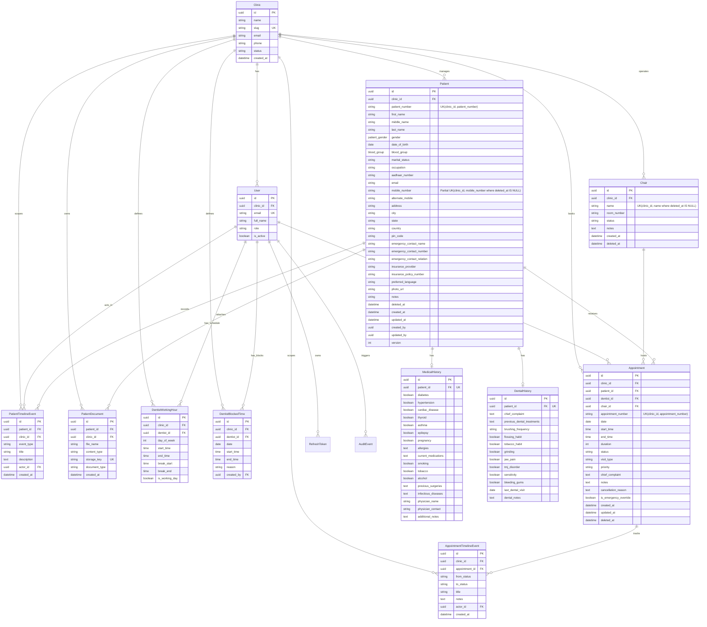
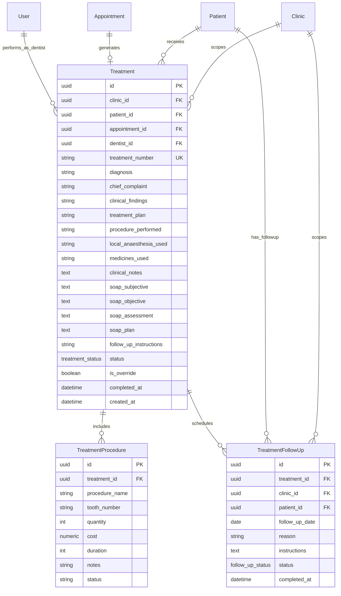

# DentalCare Pro Architecture

DentalCare Pro is a clinic-isolated modular monolith: Next.js provides the operations UI, FastAPI exposes versioned REST endpoints, PostgreSQL is the system of record, Redis supports rate limiting and background work, and storage is abstracted behind a health-checked local/S3 boundary.

## System and folders

`backend/app/api` owns HTTP delivery; `schemas` owns input/output contracts; `dependencies` enforces authentication, authorization and rate limits; `services` owns use cases; `models` owns persistence mappings; `middleware` owns request lifecycle protections; and `migrations` is the immutable database history. New domain modules follow this shape and must not query tenant data without the authenticated `clinic_id` predicate.

## Security model

All API routes are under `/api/v1`. Access JWTs are short-lived and include subject, clinic and role. Refresh tokens are random, hashed at rest, rotated one-time, grouped into families, and revoke the active family when replay is detected. Users have globally unique email addresses; only `SUPER_ADMIN` may be unassigned from a clinic. Passwords use bcrypt and require uppercase, lowercase, number, special character and 12+ characters.

Requests receive a UUID request ID, response headers, JSON logs, CSP/frame/referrer/content-type headers, CORS allow-list enforcement and consistent errors. Health probes are `/api/v1/health/live` and `/api/v1/health/ready`; readiness checks PostgreSQL, Redis and storage.

The web application keeps the refresh token in an `HttpOnly`, `SameSite=Strict` cookie through Next.js server routes. Access tokens are held only in browser memory, attached by Axios, refreshed on application restore, and invalidated by redirecting to `/login` when the session expires or an API response is unauthorized.

## Data and deployment

Every entity uses UUID identity, timestamps, soft deletion, actor audit columns and optimistic `version`. The identity schema has indexes for tenant filtering, tokens, audit queries and token expiry. Docker runs migrations before the API as an unprivileged user; Compose persists PostgreSQL and local storage. Required environment values and safe examples live in `backend/.env.example`; production rejects wildcard CORS.

Required settings are `DATABASE_URL`, `SECRET_KEY`, `JWT_SECRET`, `JWT_ALGORITHM`, `ACCESS_TOKEN_EXPIRE_MINUTES`, `REFRESH_TOKEN_EXPIRE_DAYS`, `REDIS_URL`, and `CORS_ORIGINS`. Both secrets must be at least 32 characters. `POSTGRES_PASSWORD`, `SECRET_KEY`, and `JWT_SECRET` are mandatory in Compose; no deployment secret has a repository default.

## Request lifecycle

`request -> request-id middleware -> CORS/security headers -> route dependency -> tenant/role check -> service/repository -> response/error handler -> structured audit log`. Authentication failures, validation failures, database errors and unexpected errors share one machine-readable response shape.

## Entity relationship overview

`Clinic 1--* User`, `User 1--* RefreshToken`, and `User/Clinic 1--* AuditEvent` form the foundation. Phase 2 adds `Clinic 1--* Patient`; each `Patient` has zero-or-one `MedicalHistory` and `DentalHistory`, plus append-only `PatientTimelineEvent` and `PatientDocument` collections. Patient mobile uniqueness is scoped to active records within the clinic; patient numbers are immutable clinic-scoped identifiers. Future appointment, treatment, billing and inventory entities must reference the patient and clinic while remaining soft-deletable.

## Patient Management Module

The patient module uses the repository/service split: `models/patient.py` defines normalized patient, history, timeline, and document tables; `repositories/patient_repository.py` centralizes clinic predicates, search, duplicates, and timeline reads; `services/patient_service.py` owns patient lifecycle/audit logic; and `api/v1/patients.py` is the HTTP boundary.

### Clinic Isolation & Security
All patient queries require the authenticated user's `clinic_id`. SUPER_ADMIN users without an assigned clinic are blocked from modifying or viewing tenant patient records directly unless acting in a clinic context. Documents are securely streamed through `/api/v1/patients/{patient_id}/documents/{document_id}/download` with clinic verification; raw storage URLs are never exposed publicly.

### Soft Delete & Restoration
Patients are soft-deleted by stamping `deleted_at`. Deleted patients are excluded from default directory listings and searches. Restoration resets `deleted_at = None`, reactivating the patient. Unique constraint `uq_patients_clinic_mobile_active` enforces mobile uniqueness only among active records (`WHERE deleted_at IS NULL`), permitting duplicate mobiles only if previous records were archived.

### Non-blocking Duplicate Detection
During registration and updates, the system scans for potential duplicate patients within the clinic by checking matching `mobile_number`, `email`, and `aadhaar_number`. If matching records are found, non-blocking warning payloads (`PatientDuplicateWarning`) are returned alongside the created/updated patient so receptionists and dentists are alerted without interrupting clinic workflows.

### Audit & Timeline Integration
Every patient lifecycle event generates two records:
1. System-wide immutable `AuditEvent` (for SOC2/HIPAA compliance and security analysis).
2. Patient-specific `PatientTimelineEvent` (displayed chronologically in the patient profile UI).

Timeline events record patient creation (`PATIENT_REGISTERED`), profile views (`PATIENT_VIEWED`), updates (`PATIENT_UPDATED`), archiving (`PATIENT_ARCHIVED`), restoration (`PATIENT_RESTORED`), and document attachments (`DOCUMENT_UPLOADED`).

## Appointment & Calendar Management Module

Phase 3 introduces multi-operatory scheduling, double-booking prevention, clinician calendar views, a live reception lobby queue, and lifecycle state transitions.

### Multi-Operatory Scheduling & Conflict Prevention
Every appointment belongs to a `Clinic`, `Patient`, `Dentist`, and `Chair` operatory. `AppointmentService.check_availability()` uses interval overlap arithmetic:
$$\max(S_1, S_2) < \min(E_1, E_2)$$
It guarantees that:
1. The clinician is on duty (within `dentist_working_hours` and outside lunch breaks).
2. The clinician is not blocked (`dentist_blocked_times`).
3. The clinician is not double-booked with another active visit.
4. The physical chair (`chairs`) is not occupied by another procedure.
5. The patient is not booked in another chair at the same time.

### Emergency Admin Override
Appointments with `visit_type = EMERGENCY` can bypass schedule and chair conflicts only when submitted by `CLINIC_ADMIN` or `SUPER_ADMIN` with `is_emergency_override = True`. The appointment is permanently tagged with the override flag, logged to the clinical audit trail, and visually highlighted with high-contrast emergency warning badges in all views.

### State Machine & Completed Immutability
Appointments follow a strict progression:
- `SCHEDULED` -> `CONFIRMED` -> `CHECKED_IN` (In Lobby) -> `IN_CHAIR` (In Treatment) -> `COMPLETED`
- Rescheduling resets status to `SCHEDULED` with mandatory reason.
- Cancellation requires a mandatory reason and moves to terminal `CANCELLED`.
- **Completed Immutability**: Any appointment in `COMPLETED` status is locked against modifications, cancellations, rescheduling, or deletion.

### Dual Timeline & Notifications
- Every appointment transition logs an `AppointmentTimelineEvent` and appends a `PatientTimelineEvent` to the patient's record.
- Decoupled `NotificationService` dispatches events (`CONFIRMATION`, `REMINDER`, `CANCELLATION`, `RESCHEDULE`, `FOLLOW_UP`) through abstract notification channel protocols.

## Treatment Management Module (Phase 4)

Phase 4 establishes the core clinical workflow, transforming visits into immutable, structured clinical records.

### Clinical Model & ERD
Every `Treatment` record represents a clinical session and is strictly isolated by `clinic_id`.
- `Treatment` belongs to: `Clinic`, `Patient`, `Appointment`, `Dentist`.
- `TreatmentProcedure`: child records charting individual clinical procedures with `procedure_name`, `tooth_number` (prep for Phase 5 Odontogram), `quantity`, `cost`, `duration`, and `status`.
- `TreatmentFollowUp`: post-operative scheduled check-ups with `follow_up_date`, `reason`, `instructions`, and `status`.

### Single Active Treatment & Admin Override Rule
- Under standard clinical workflows, only one active treatment (`status != CANCELLED` and `deleted_at IS NULL`) is permitted per appointment.
- Attempting to create an additional active treatment for the same appointment without override raises `400 Bad Request`.
- If an override is necessary (e.g. secondary procedure by a specialist during an ongoing session), `is_override = True` must be set and the action is restricted to `CLINIC_ADMIN` or `SUPER_ADMIN` (`403 Forbidden` if attempted by regular staff).
- Override records are permanently flagged with `is_override = true` and highlighted in audit logs and user interfaces.

### Appointment State Synchrony
- Creating a treatment initiates the clinical session and automatically advances the linked `Appointment` from `SCHEDULED` or `CHECKED_IN` to `IN_TREATMENT` (`IN_CHAIR`).
- The appointment's `start_datetime` is stamped with the treatment creation timestamp and an `AppointmentTimelineEvent` (`TREATMENT_STARTED`) is appended.
- Completing a treatment can optionally finalize the linked appointment to `COMPLETED` (`end_datetime` stamped).

### Completed Record Immutability
- In compliance with dental malpractice and clinical record regulations, any treatment with `status = COMPLETED` is permanently locked.
- Updating (`PATCH`), cancelling (`POST /cancel`), or deleting (`DELETE`) a completed treatment is strictly rejected with `400 Bad Request`.
- Post-completion notes must be appended as completion notes or charted as a new clinical session.

### Dual Timeline & Security Auditing
- Every treatment event triggers two audit streams:
  1. System-wide `AuditEvent` (`CREATE`, `UPDATE`, `COMPLETE`, `CANCEL`, `DELETE`) with full JSON metadata.
  2. Patient-specific `PatientTimelineEvent` (`TREATMENT_CREATED`, `TREATMENT_UPDATED`, `TREATMENT_COMPLETED`, `TREATMENT_CANCELLED`) with clinician attribution.

## API conventions

Success responses preserve the established Phase 1 resource contracts. All errors use `success`, `message`, `error.code`, `timestamp`, `path`, and `request_id`, so clients can safely correlate an error to a structured request log. Pagination uses `skip` and bounded `limit`; endpoint summaries, tags, descriptions, and error responses are exposed through `/api/v1/docs` and `/api/v1/openapi.json`.

## Operations

`python -m app.scripts.seed` is an idempotent development seed command. It requires `DEMO_SEED_PASSWORD` and creates the demo clinic plus one account for every Phase 1 role. CI runs Ruff, tests with an 80% coverage gate, the frontend production build, Alembic upgrade, and Alembic model-drift validation.

