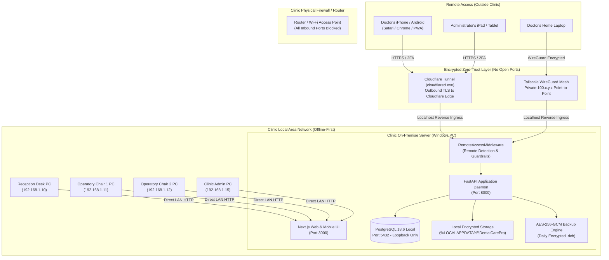
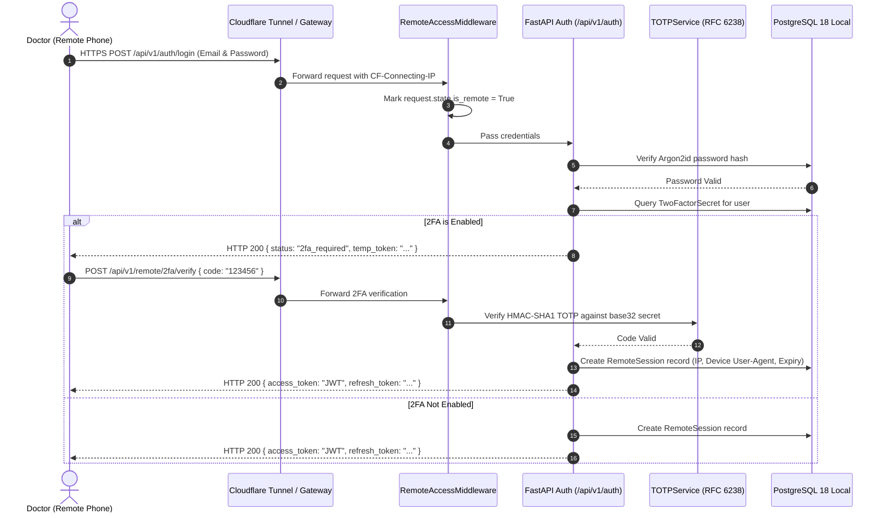

# DentalCare Pro – Hybrid Local + Secure Remote Access Architecture

**Edition**: Local Clinic Edition (One-Time Purchase)  
**Security Model**: Zero-Trust Ingress / On-Premise Single Source of Truth  
**Target Operating Systems**: Windows 11 / Windows 10 / Windows Server 2022 / Mobile Web (iOS & Android)

---

## 1. System Overview & Architectural Philosophy

DentalCare Pro operates under an **Offline-First, On-Premise Core** philosophy:
1. **The Clinic Server is the Single Source of Truth**: All clinical records, odontograms, digital radiographs, prescriptions, invoices, and audit trails reside on the local clinic computer running PostgreSQL 18.
2. **Local Clinic Operations Are Never Interrupted**: Reception PCs, dentist operatory chairs, and admin laptops communicate directly across the Clinic Local Area Network (LAN) using local IP addresses (`192.168.x.x` or `10.x.x.x`). Internet failure, router ISP drops, or remote tunnel disconnection have **zero impact** on in-clinic clinical care.
3. **Remote Access is 100% Optional & Ingress-Only**: Remote access (for doctors checking schedules from home or viewing treatment history on a phone) is routed through an encrypted tunnel (Cloudflare Tunnel or Tailscale WireGuard).
4. **No Open Inbound Ports**: The clinic router never has port forwarding enabled (no open port 80, 443, 5432, or 8000). The tunnel creates an outbound encrypted connection to the tunnel edge.
5. **Strict Remote Guardrails**: Remote users can perform safe reads and safe edits (confirm, cancel, reschedule, notes), but **destructive operations** (deleting patients, deleting invoices, deleting treatments, dropping backups, database administration) are strictly rejected with **HTTP 403 Forbidden**.

---

## 2. Network Topology & Architecture Diagram

---

## 3. Remote Security Model & Guardrails Matrix

### 3.1 Prohibited vs. Permitted Remote Operations

| Operation Type | Endpoint / Action | Local Clinic LAN | Remote (Tunnel/WAN) | Enforcement Mechanism |
|---|---|---|---|---|
| **View Schedule (Today/Tomorrow/Week)** | `GET /api/v1/appointments/*` | Permitted | Permitted | RBAC Role Check |
| **Search Patients & Medical Profiles** | `GET /api/v1/patients/*` | Permitted | Permitted | RBAC Role Check |
| **View Treatments, SOAP Notes, Odontogram** | `GET /api/v1/treatments/*` | Permitted | Permitted | RBAC Role Check |
| **View Invoices & Revenue Dashboards** | `GET /api/v1/billing/*` | Permitted | Permitted | RBAC Role Check |
| **View Inventory & Low Stock Alerts** | `GET /api/v1/inventory/*` | Permitted | Permitted | RBAC Role Check |
| **Confirm / Cancel / Reschedule Visits** | `PATCH /api/v1/appointments/{id}` | Permitted | Permitted | Safe Remote Action |
| **Add Clinical Notes & Comments** | `POST /api/v1/treatments/{id}/notes` | Permitted | Permitted | Safe Remote Action |
| **Update Patient Contact Info** | `PATCH /api/v1/patients/{id}` | Permitted | Permitted | Safe Remote Action |
| **Delete Patient Record** | `DELETE /api/v1/patients/{id}` | Permitted | **BLOCKED (403)** | `RemoteAccessMiddleware` |
| **Delete Invoice or Financial Record** | `DELETE /api/v1/invoices/{id}` | Permitted | **BLOCKED (403)** | `RemoteAccessMiddleware` |
| **Delete Clinical Treatment Record** | `DELETE /api/v1/treatments/{id}` | Permitted | **BLOCKED (403)** | `RemoteAccessMiddleware` |
| **Delete or Purge Backup Archives** | `DELETE /api/v1/backups/{id}` | Permitted | **BLOCKED (403)** | `RemoteAccessMiddleware` |
| **Database Restore / Schema Administration** | `POST /api/v1/backups/restore` | Permitted | **BLOCKED (403)** | `RemoteAccessMiddleware` |

---

## 4. Remote Authentication & 2FA Flow

---

## 5. Mobile Clinical Workflow

1. **One-Handed Navigation**: Designed specifically for quick consultation between surgeries or while commuting.
2. **Dedicated Mobile Dashboard (`/mobile`)**:
   - **Today's Tab**: High-contrast cards for each patient with scheduled time, chief complaint, chair number, and quick status chips.
   - **Tomorrow's Tab**: Schedule preview to prepare morning surgical kits and laboratory requirements.
   - **Week Calendar**: Visual capacity indicator showing patient booking density across the week.
   - **Revenue Tab**: Today's collections, UPI vs Cash breakdown, and pending invoices total.
   - **Alerts Tab**: Immediate notifications for critical inventory items running low.
3. **Safe Quick Actions**: Tap to confirm patient arrivals, reschedule appointments, or dictate clinical notes without risking unintended deletion.
