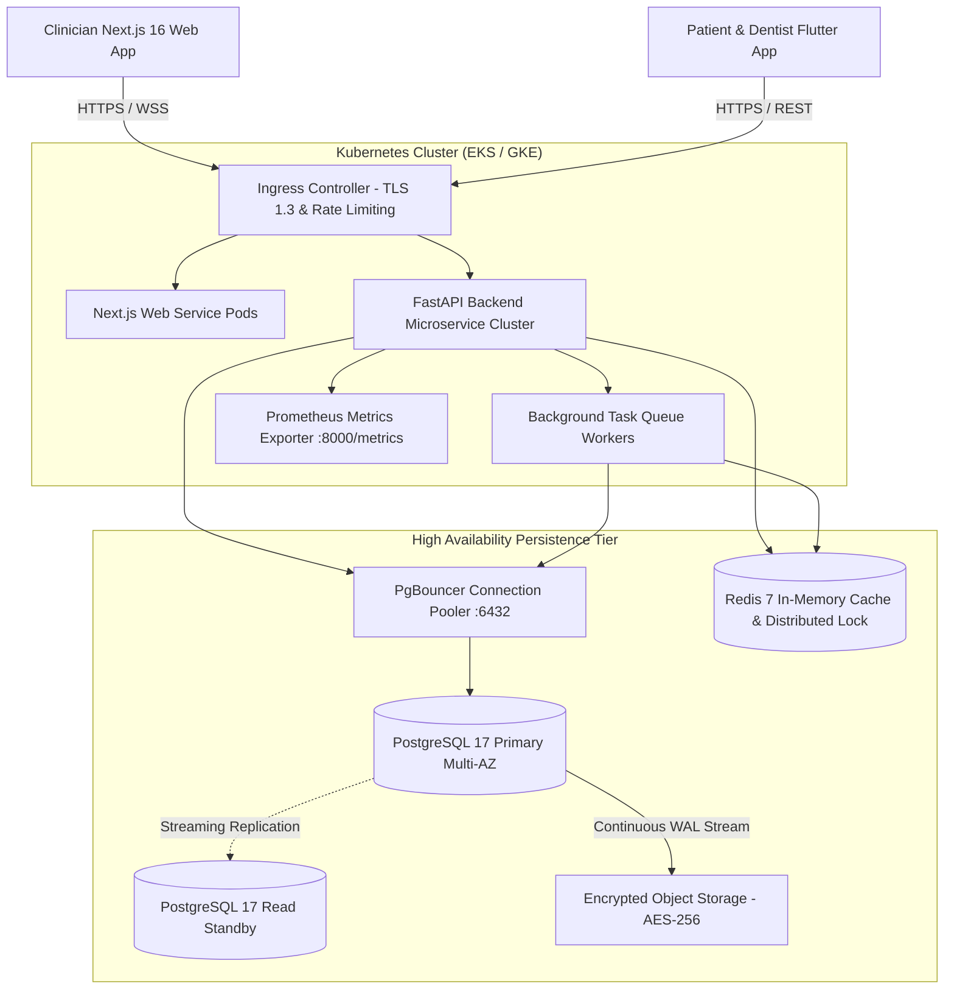

# DentalCare Pro - Enterprise System Architecture & Engineering Blueprint

## 1. Architectural Philosophy
DentalCare Pro is engineered according to the following foundational tenets:
1. **Cloud-Native & Modular**: Deployable to any major cloud provider (AWS, GCP, Azure) or bare-metal Kubernetes.
2. **Zero-Trust Multi-Tenancy**: Complete logical separation between dental practices, organizations, and clinics.
3. **Offline-First Resilience**: Full chairside operational capability during cloud or internet outages.
4. **Strict Regulatory Compliance**: Built-in HIPAA Security Rule technical safeguards, GDPR data protection, and immutable audit streaming.

---

## 2. High-Level Architecture Diagram

---

## 3. Data Architecture & Entity Relationship Summary

The schema consists of over 50 normalized relational entities structured across domains:
- **Identity & Organization**: `organizations`, `regions`, `clinics`, `users`, `departments`, `user_branch_assignments`.
- **Patient Health Records**: `patients`, `medical_histories`, `dental_histories`, `patient_timeline_events`, `consent_records`.
- **Clinical Dentistry**: `appointments`, `chairs`, `treatments`, `treatment_procedures`, `treatment_follow_ups`, `teeth`, `tooth_surfaces`.
- **Pharmacy & Billing**: `prescriptions`, `prescription_items`, `invoices`, `invoice_items`, `payments`.
- **Insurance & Claims**: `insurance_providers`, `insurance_plans`, `patient_insurance_policies`, `insurance_claims`.
- **Workforce & HR**: `employees`, `work_shifts`, `attendance_records`, `leave_requests`, `payroll_runs`, `payslips`.
- **Audit & Telemetry**: `audit_events`, `ai_audit_logs`.
