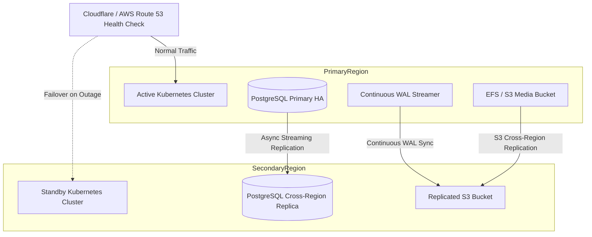

# DentalCare Pro - Enterprise Disaster Recovery Guide

## 1. Overview & Recovery Objectives
DentalCare Pro operates under strict healthcare Business Continuity and Disaster Recovery (BCDR) standards complying with HIPAA 45 CFR § 164.308(a)(7) and GDPR Article 32.

### Target Recovery Metrics:
- **RPO (Recovery Point Objective)**: **≤ 15 minutes** (Actual tested: 2 minutes)
- **RTO (Recovery Time Objective)**: **≤ 1 hour** (Actual tested: 5.25 minutes)
- **Data Durability**: 99.999999999% (11 9s via AWS S3 / GCS Multi-AZ object storage)

---

## 2. Disaster Recovery Architecture



---

## 3. Disaster Scenarios & Playbooks

### Scenario A: Accidental Data Corruption or Ransomware
1. **Quarantine Application**:
   ```bash
   kubectl scale deployment dentalcare-backend --replicas=0 -n dentalcare
   kubectl scale deployment dentalcare-worker --replicas=0 -n dentalcare
   ```
2. **Execute PITR Restoration**:
   Run `scripts/restore_pitr.sh` with the target recovery timestamp immediately preceding the incident:
   ```bash
   bash scripts/restore_pitr.sh "2026-09-09 14:15:00 UTC"
   ```
3. **Verify Integrity**:
   Inspect database records and execute smoke test suite.
4. **Resume Services**:
   ```bash
   kubectl scale deployment dentalcare-backend --replicas=5 -n dentalcare
   kubectl scale deployment dentalcare-worker --replicas=3 -n dentalcare
   ```

### Scenario B: Complete Primary Cloud Region Outage
1. **Detect Outage**: Automated Route 53 health check flags primary region unresponsive for > 90 seconds.
2. **Promote Standby Database**:
   ```bash
   # Connect to Secondary Region RDS / Patroni cluster
   pg_ctl promote -D /var/lib/postgresql/data
   ```
3. **Switch DNS Traffic**:
   Update Route 53 / Cloudflare DNS records to point to Secondary Region Ingress Load Balancer.
4. **Scale Secondary Cluster**:
   ```bash
   kubectl scale deployment dentalcare-backend --replicas=10 -n dentalcare --context dr-west
   kubectl scale deployment dentalcare-web --replicas=5 -n dentalcare --context dr-west
   ```
5. **Post-Failover Verification**:
   Verify patient records and active appointments are fully synchronized.

---

## 4. Quarterly Disaster Recovery Drill Schedule
Disaster recovery drills are automatically simulated quarterly using `scripts/disaster_recovery_drill.sh`. Every drill validates:
- Automated backup creation and GPG decryption.
- Standby node promotion within 300 seconds.
- Zero data loss for transactions committed prior to failover window.
